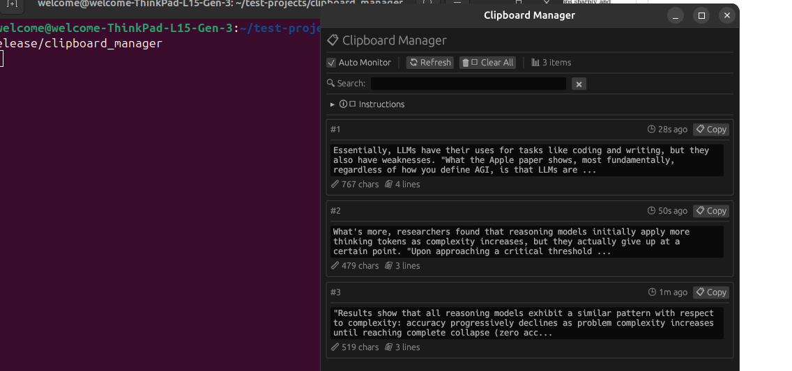

# 📋 Clipboard Manager

A powerful, cross-platform clipboard history manager built with Rust and egui. Keep track of everything you copy and easily access your clipboard history with a clean, intuitive interface.


## ✨ Features

- **🔄 Automatic Clipboard Monitoring** - Automatically captures everything you copy
- **📚 History Management** - Stores up to 50 clipboard entries with timestamps
- **🔍 Search & Filter** - Quickly find specific clipboard entries
- **🎯 One-Click Copy** - Copy any historical entry back to clipboard
- **⏰ Time Tracking** - See when each item was copied (seconds, minutes, hours ago)
- **📊 Entry Statistics** - View character count and line count for each entry
- **🎨 Clean UI** - Modern, responsive interface built with egui
- **🔧 Toggle Controls** - Enable/disable auto-monitoring as needed
- **🗑️ Bulk Actions** - Clear all history with one click

## 🚀 Getting Started

### Prerequisites

- Rust (latest stable version)
- Cargo (comes with Rust)

### Dependencies

This project uses the following crates:
- `eframe` - GUI framework
- `egui` - Immediate mode GUI library
- `clipboard` - Cross-platform clipboard access

### 🔨 Build Commands

```bash
# Clone the repository
git clone <your-repo-url>
cd clipboard-manager

# Build in debug mode
cargo build

# Build in release mode (optimized)
cargo build --release

# Build and run in debug mode
cargo run

# Build and run in release mode
cargo run --release
```

### 🏃‍♂️ Running the Application

```bash
# Run in debug mode (slower, with debug info)
cargo run

# Run in release mode (faster, optimized)
cargo run --release

# Or run the compiled binary directly
./target/release/clipboard-manager  # Linux/macOS
./target/release/clipboard-manager.exe  # Windows
```

## 📖 How to Use

1. **Start the Application** - Run the program using one of the commands above
2. **Copy Text** - Copy text normally (Ctrl+C / Cmd+C) - it will automatically appear in the history
3. **Browse History** - Scroll through your clipboard history in the main window
4. **Search** - Use the search box to filter entries by content
5. **Copy Back** - Click the "📋 Copy" button next to any entry to copy it back to your clipboard
6. **Manage** - Use the toolbar to:
   - Toggle auto-monitoring on/off
   - Refresh manually
   - Clear all history
   - View total item count

## 🎮 Interface Guide

### Main Controls
- **Auto Monitor** - Toggle automatic clipboard monitoring
- **🔄 Refresh** - Manually check for new clipboard content
- **🗑️ Clear All** - Remove all clipboard history
- **📊 Item Counter** - Shows total number of stored items

### Search & Filter
- **🔍 Search Box** - Type to filter entries by content
- **✖ Clear Search** - Reset search filter

### Entry Information
- **#N** - Entry number (most recent = #1)
- **🕒 Timestamp** - How long ago the item was copied
- **📏 Character Count** - Total characters in the entry
- **📄 Line Count** - Number of lines in the entry
- **📋 Copy Button** - Copy this entry back to clipboard

## ⚙️ Configuration

The application is configured with the following defaults:
- **Maximum entries**: 50 items
- **Monitor interval**: 500ms
- **Window size**: 600x700 pixels (resizable, minimum 400x300)

To modify these settings, edit the relevant constants in the source code:
- `ClipboardStack::new(50)` - Change max entries
- `Duration::from_millis(500)` - Change monitoring frequency
- Window dimensions in `main()` function

## 🛠️ Development

### Project Structure
```
src/
├── main.rs          # Main application code
└── ...

Cargo.toml           # Dependencies and project metadata
```

### Key Components
- **`ClipEntry`** - Represents a single clipboard entry with content and timestamp
- **`ClipboardStack`** - Manages the collection of clipboard entries
- **`ClipboardApp`** - Main application logic and GUI implementation

### Adding Features
The codebase is well-structured for extending functionality:
- Add new entry types in `ClipEntry`
- Extend filtering logic in `filtered_entries()`
- Modify UI layout in the `update()` method

## 🐛 Troubleshooting

### Common Issues

**Clipboard access fails**
- Ensure your system allows clipboard access
- On Linux, you may need `xclip` or `xsel` installed

**Application doesn't start**
- Check that all dependencies are installed: `cargo check`
- Try rebuilding: `cargo clean && cargo build`

**High CPU usage**
- The app monitors clipboard every 500ms by default
- Disable "Auto Monitor" if not needed continuously

## 📝 License

This project is open source. Please add your preferred license here.

## 🤝 Contributing

Contributions are welcome! Please feel free to submit pull requests or open issues for bugs and feature requests.

## 🙏 Acknowledgments

- Built with [egui](https://github.com/emilk/egui) - Immediate mode GUI library
- Uses [eframe](https://github.com/emilk/egui/tree/master/crates/eframe) - GUI framework
- Clipboard access via [clipboard](https://github.com/aweinstock314/rust-clipboard) crate
